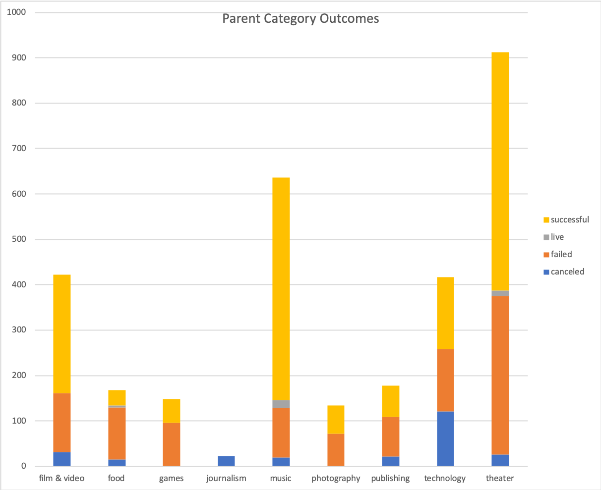

# An Analysis of Kickstarter Campaigns
Performing Analysis on Kickstarter data to uncover Trends (Bootcamp)

## introduction
We are analyzing kickstarter data to help optimize a upcoming campaign for the Play "Fever". Utilizing data from successful, canceled, and failed campaigns around the world we explore factors in successful campaigns, as well as focus on campaigns that have a similar goal as well as category.

Based on our analysis, we can conclde that opeing the campaign in May would give the best chace of success. Theatre campaigns do their best starting in may, and begin to lower their success rate rfom june through the end of the year. Of he 166 theatre campains launched in May, 111 of them were successful.

### Stuff

